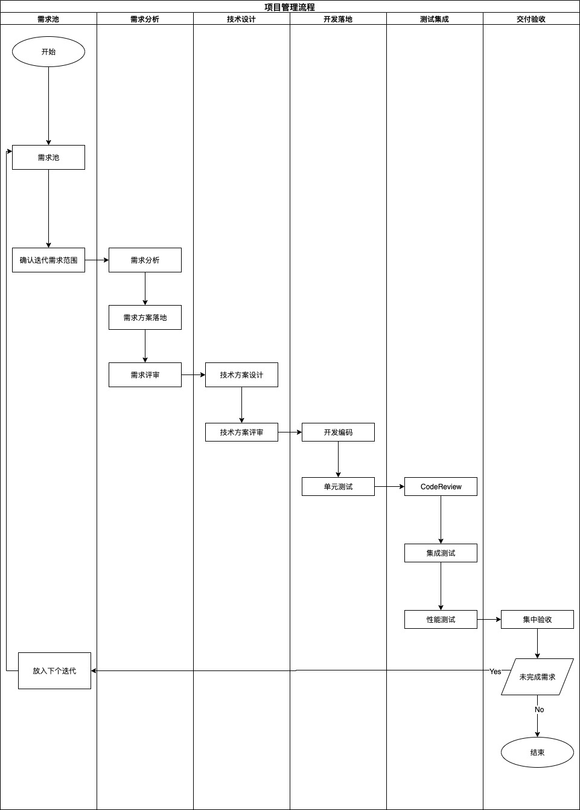

## 流程向导

### 目的
- 提高交付质量
- 提高人效
- 降低复杂度
### 原则
- 简单
- 执行
- 迭代
------
#### 项目管理流程

#### 开发流程
- 文档先行
- 逻辑伪代码实现
- 代码落地
- 持续优化
#### git工作流程
- 本地分支rebase到常驻分支
- 常驻分支尽量保持干净
- 及时打标签、清理临时分支
#### CodeReview流程
- 功能的次要负责人一轮
- 合入常驻分支项目负责人一轮
#### 测试流程
- 单元测试
- 性能测试
#### 交付流程
- 持续自动集成
